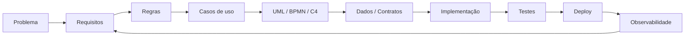

<p align="center"></p>

# Engineering Portfolio & Knowledge Base

Portfólio técnico para organizar **software executável, arquitetura, skills reutilizáveis, decisões de engenharia e evolução open source**.

<p align="center">
<a href="https://github.com/Videirafo/Fernando_Videira/actions/workflows/portfolio-quality.yml"></a>
<a href="https://github.com/Videirafo/Fernando_Videira/actions/workflows/repo-health-auditor.yml"></a>
<a href="https://github.com/Videirafo/Fernando_Videira/actions/workflows/repoguard-github-app.yml"></a>
<a href="https://github.com/Videirafo/Fernando_Videira/actions/workflows/mcp-policy-firewall.yml"></a>
<a href="https://github.com/Videirafo/Fernando_Videira/actions/workflows/tenant-isolation-verifier.yml"></a>
</p>

> Conhecimento e projetos públicos, sem expor código privado, credenciais, clientes ou infraestrutura sensível.

## Engenharia

```text
REQUIREMENTS → ARCHITECTURE → BUILD → TEST → REVIEW → SHIP → OBSERVE → IMPROVE
```

Foco:

- SaaS multi-tenant;
- AI Agents, RAG, tools, guardrails e MCP;
- CRM, agenda e atendimento omnichannel;
- APIs e integrações;
- Next.js / React / TypeScript;
- Node.js e Python;
- PostgreSQL / Supabase / Redis;
- Linux / Docker / Nginx / CI/CD;
- UML / BPMN / C4 / ADR / OpenAPI / AsyncAPI;
- testes, segurança, acessibilidade e observabilidade.

## Stack de engenharia

<p align="center"></p>

> **Python backend está em evolução contínua**, com Django/DRF e FastAPI aplicados a APIs, autenticação, services, testes, OpenAPI e ASGI.

## Projetos públicos principais

### [SaaS Engineering Playbook](https://github.com/Videirafo/SaaS-Engineering-Playbook)
Manual público para arquitetura SaaS, multi-tenancy, segurança, APIs, testes, observabilidade e produção. Inclui um dashboard Next.js executável.

### [AI Agent Production Checklist](https://github.com/Videirafo/AI-Agent-Production-Checklist)
Checklist de produção para guardrails, tool policies, RAG/memória, evals, tracing, approvals e incident response. Inclui uma Safe Agent API em FastAPI.

### [System Modeling Starter](https://github.com/Videirafo/System-Modeling-Starter)
Starter para requirements, UML, BPMN, C4, ERD, ADR, OpenAPI, AsyncAPI e rastreabilidade. Inclui um Booking Reference System executável.

## Security, Platform & Agent Labs

| Projeto | Stack | Demonstração | CI |
|---|---|---|---|
| [GitHub Repo Health Auditor](./projects/github-repo-health-auditor) | Python · httpx · GitHub REST API | community health, CI, SECURITY, scoring e relatórios | `pytest` + CLI smoke |
| [RepoGuard GitHub App](./projects/repoguard-github-app) | Node.js 24 · GitHub Apps · Webhooks | HMAC, JWT, installation token e PR policy automation | syntax + `node:test` |
| [MCP Policy Firewall Lab](./projects/mcp-policy-firewall-lab) | Node.js 24 · JSON-RPC | default-deny, constraints, approval e audit evidence | tests + allow/deny demos |
| [Tenant Isolation Verifier](./projects/tenant-isolation-verifier) | Node.js 24 · local API | BOLA, cross-tenant matrix e leak detection | tests + integration demo |

## Clone & Build

Os projetos foram organizados para quem quiser **clonar, abrir no VS Code, executar, testar e evoluir via Git**.

```text
git clone
→ code .
→ Run / Debug ou VS Code Task
→ build / tests
→ git switch -c feat/minha-mudanca
→ git add .
→ git commit
→ git push
→ Pull Request
```

Exemplos externos deste portfólio:

| Projeto | Stack | Validação |
|---|---|---|
| [SaaS Tenant Dashboard](https://github.com/Videirafo/SaaS-Engineering-Playbook/tree/main/examples/saas-tenant-dashboard) | Next.js · React · TypeScript | typecheck + production build |
| [Safe Agent API](https://github.com/Videirafo/AI-Agent-Production-Checklist/tree/main/examples/safe-agent-api) | Python · FastAPI · pytest | pytest |
| [Booking Reference System](https://github.com/Videirafo/System-Modeling-Starter/tree/main/examples/booking-reference-system) | Python · FastAPI · Mermaid | install + pytest |

## O que eu construo

| Área | Aplicação prática |
|---|---|
| **SaaS** | multi-tenancy, onboarding, permissions, billing e isolamento |
| **AI Agents** | RAG, tools, MCP, guardrails, memória, handoff e evals |
| **GitHub Engineering** | Apps, REST API, webhooks, PR automation e repository health |
| **Backend** | APIs, autenticação, autorização, dados e integrações |
| **Architecture** | requisitos, UML, C4, BPMN, ADRs e contratos |
| **DevOps** | VPS, Docker, Nginx, CI/CD, backup, rollback e monitoramento |
| **Security** | tenant isolation, BOLA tests, policy enforcement e secrets hygiene |

## Case sanitizado · MarcaIA

**SaaS multi-tenant para atendimento, agenda, CRM e automações com IA.**

`Next.js` · `TypeScript` · `PostgreSQL` · `Supabase` · `Tailwind` · `VPS` · `AI Agents`

Foco público de engenharia: onboarding multi-tenant, agenda, atendimento, CRM, isolamento de dados, agentes, deploy e observabilidade. Nenhum código, credencial ou infraestrutura privada é exposto.

Veja também: **[Em desenvolvimento](./Em_desenvolvimento/README.md)**.

## Knowledge Base

<p align="center"></p>

### Sistema mestre

**[VIDEIRA OMEGA STUDIO OS](./skills/VIDEIRA_OMEGA_STUDIO_OS.md)**

```text
RECALL → CLASSIFY → DISCOVER → GROUND → SPECIFY → DESIGN → PLAN
→ ISSUE/BRANCH → BUILD → TEST → REVIEW → SHIP → OBSERVE → LEARN → REMEMBER
```

### Skills especializadas

| Skill | Conhecimento |
|---|---|
| [SYSTEM-MODELING-2026](./skills/SYSTEM_MODELING_2026.md) | requisitos, UML, BPMN, C4, ERD, ADR e contratos |
| [PY-BACKEND-2026](./skills/PYTHON_BACKEND_2026.md) | Django/DRF, FastAPI, APIs, segurança, testes e deploy |
| [GITHUB-PRO-2026](./skills/GITHUB_PORTFOLIO_OS_2026.md) | GitHub Flow, README, portfólio e qualidade |
| [AI Agent Engineering](./skills/AI_AGENT_ENGINEERING.md) | agentes, RAG, GraphRAG, tools, MCP/A2A, guardrails e avaliação |
| [Execution & Project Memory](./skills/EXECUTION_PROJECT_MEMORY.md) | Project Studio, COHI, PM26/PACREF e Second Brain |
| [Frontend Product Experience](./skills/FRONTEND_PRODUCT_EXPERIENCE.md) | React/Next.js, mobile-first, acessibilidade e performance |
| [VPS & Production Engineering](./skills/VPS_PRODUCTION_ENGINEERING.md) | Linux, Docker, Nginx, deploy, rollback e observabilidade |
| [Game Studio Mobile](./skills/GAME_STUDIO_MOBILE.md) | game design, arquitetura mobile, save e publicação |

**[Abrir catálogo completo de skills →](./skills/README.md)**

## Arquitetura e rastreabilidade



## Open Source & GitHub Growth

```text
Projetos públicos úteis
→ Issues bem especificadas
→ PRs pequenos e verificáveis
→ CI verde
→ releases
→ contribuições externas
→ colaboração real
→ usuários / stars orgânicas
```

- [GitHub Growth Roadmap](./docs/GITHUB_GROWTH_2026.md)
- [Achievements & Badges 2026](./docs/ACHIEVEMENTS_AND_BADGES_2026.md)
- [Open Source Targets](./docs/OPEN_SOURCE_TARGETS_2026-08.md)
- [Public Project Strategy](./docs/PUBLIC_PROJECT_STRATEGY.md)

## Princípios

```text
Inspect before changing
Small reversible changes
Issue → Branch → Pull Request
Security by design
Tests for critical behavior
Observability before incidents
Backup and rollback before risky changes
Architecture decisions are recorded
```

## Segurança e privacidade

Este portfólio público não deve conter senhas, tokens/API keys, `.env` reais, chaves privadas, IPs/endpoints sensíveis, dados de clientes, dumps de bancos, conversas privadas ou código proprietário.

Consulte [SECURITY.md](./SECURITY.md).

---

<div align="center">

**Build · Test · Ship · Observe · Improve**

`Software Engineering` · `SaaS` · `AI Agents` · `GitHub Apps` · `Security` · `DevOps`

</div>
