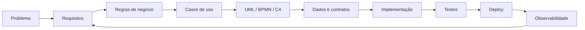

<div align="center">

# Fernando Videira

### Software Engineering · SaaS · AI Agents · Full Stack · DevOps

[](https://git.io/typing-svg)

**Transformando problemas reais em sistemas organizados, testáveis e prontos para evoluir.**

</div>

---

## Sobre mim

Atuo em engenharia de software com foco em construir produtos digitais completos, do levantamento do problema ao deploy e à operação.

Meu fluxo de trabalho prioriza:

```text
REQUIREMENTS → ARCHITECTURE → BUILD → TEST → REVIEW → SHIP → OBSERVE → IMPROVE
```

Áreas de maior interesse e prática:

- SaaS multi-tenant
- agentes de IA e automação conversacional
- WhatsApp / Instagram e atendimento omnichannel
- CRM, agenda e fluxos operacionais
- APIs e integrações
- infraestrutura Linux/VPS
- modelagem de software com UML, C4 e BPMN
- testes, segurança, acessibilidade e observabilidade

---

## Stack de engenharia

### Frontend

<p>
  
</p>

### Backend, dados e APIs

<p>
  
</p>

### Infraestrutura e entrega

<p>
  
</p>

### Backend Python em evolução

<p>
  
</p>

Estudo e aplicação de padrões modernos de **Django/DRF** e **FastAPI**, com foco em APIs, autenticação, service layer, testes, documentação OpenAPI e deploy ASGI.

---

## O que eu construo

| Área | Aplicação prática |
|---|---|
| **SaaS** | multi-tenancy, onboarding, permissões, catálogo, billing e isolamento por tenant |
| **AI Agents** | orquestração, RAG, tools, guardrails, memória, avaliação e handoff humano |
| **Messaging** | WhatsApp, Instagram, inbox, atendimento e automações |
| **CRM & Scheduling** | leads, agenda, serviços, profissionais, confirmações e notificações |
| **Backend** | APIs, autenticação, autorização, modelagem de dados e integrações |
| **Architecture** | UML, C4, BPMN, ADRs, contratos e rastreabilidade |
| **DevOps** | VPS, Linux, Nginx, Docker, CI/CD, deploy, backup e rollback |
| **Quality** | testes, segurança, acessibilidade, logs, métricas e observabilidade |

---

## Engenharia de requisitos e arquitetura

Documentação faz parte do sistema. O objetivo é manter especificação e implementação sincronizadas.



Artefatos que uso e estudo:

- Casos de Uso e especificações textuais
- Activity, Sequence, State e Class diagrams
- C4 System Context, Container e Component
- BPMN para processos de negócio
- ERD e modelo relacional
- OpenAPI / AsyncAPI
- Architecture Decision Records
- rastreabilidade requisito → código → teste

---

## IA e automação

```text
AI Engineering
├── LLM orchestration
├── RAG / GraphRAG
├── tool calling
├── MCP / agent interoperability
├── guardrails
├── conversation memory
├── human handoff
├── evaluation
└── observability
```

Interesses de engenharia relacionados:

- automação de workflows
- agentes para atendimento e operação
- CRM e mensageria
- processamento assíncrono
- eventos e integrações
- logs estruturados e auditoria

---

## Projetos e cases em desenvolvimento

> Parte dos projetos de produto permanece em repositórios privados. Aqui são apresentados somente escopo e decisões de engenharia, sem código, segredos ou dados sensíveis.

### MarcaIA

**SaaS multi-tenant para atendimento, agenda, CRM e automações com IA.**

`Next.js` · `TypeScript` · `PostgreSQL` · `Supabase` · `Tailwind` · `VPS` · `AI Agents`

Foco de engenharia:

- onboarding multi-tenant
- agenda e marcação inteligente
- serviços e profissionais
- atendimento WhatsApp / Instagram
- CRM operacional
- autenticação e isolamento de dados
- arquitetura preparada para agentes de IA
- deploy, observabilidade e evolução por GitHub Flow

### AI Agents & Automation Lab

Pesquisa e prototipação de arquiteturas para agentes de produção:

- WhatsApp / Instagram agents
- RAG e recuperação contextual
- workflows e orquestração
- Chatwoot / CRM handoff
- guardrails
- logs e avaliação
- APIs oficiais e integrações

### Software Modeling 2026

Sistema de engenharia para transformar requisitos em implementação verificável:

`Requirements` → `Use Cases` → `UML` → `BPMN` → `C4` → `API Contracts` → `ADRs` → `Tests`

Veja também: **[Em desenvolvimento](./Em_desenvolvimento/README.md)**

---

## Knowledge Base · Skills de engenharia

Além dos projetos, mantenho uma base pública de habilidades reutilizáveis criadas e refinadas durante o desenvolvimento real de sistemas.

### Sistema mestre

**[VIDEIRA OMEGA STUDIO OS](./skills/VIDEIRA_OMEGA_STUDIO_OS.md)**

```text
RECALL → CLASSIFY → DISCOVER → GROUND → SPECIFY → DESIGN → PLAN
→ ISSUE/BRANCH → BUILD → TEST → REVIEW → SHIP → OBSERVE → LEARN → REMEMBER
```

### Skills especializadas

| Skill | Conhecimento |
|---|---|
| [SYSTEM-MODELING-2026](./skills/SYSTEM_MODELING_2026.md) | requisitos, Caso de Uso, UML, BPMN, C4, ERD, ADR e contratos |
| [PY-BACKEND-2026](./skills/PYTHON_BACKEND_2026.md) | Django/DRF, FastAPI, APIs, segurança, testes e deploy |
| [GITHUB-PRO-2026](./skills/GITHUB_PORTFOLIO_OS_2026.md) | GitHub Flow, README, portfólio e qualidade de repositório |
| [AI Agent Engineering](./skills/AI_AGENT_ENGINEERING.md) | agentes, RAG, GraphRAG, tools, MCP/A2A, guardrails e avaliação |
| [Execution & Project Memory](./skills/EXECUTION_PROJECT_MEMORY.md) | Project Studio, COHI, PM26/PACREF, Focus Execution e Second Brain |
| [Frontend Product Experience](./skills/FRONTEND_PRODUCT_EXPERIENCE.md) | React/Next.js, mobile-first, acessibilidade, UI/UX e performance |
| [VPS & Production Engineering](./skills/VPS_PRODUCTION_ENGINEERING.md) | Linux, Docker, Nginx, deploy, backup, rollback e observabilidade |
| [Game Studio Mobile](./skills/GAME_STUDIO_MOBILE.md) | game design, arquitetura mobile, save, economia, monetização e publicação |

**[Abrir catálogo completo de skills →](./skills/README.md)**

---

## Open Source & GitHub Growth

O objetivo não é acumular atividade artificial. A estratégia é usar GitHub como evidência pública de engenharia.

```text
Projetos públicos úteis
→ Issues bem especificadas
→ PRs pequenos e verificáveis
→ CI verde
→ contribuições externas
→ colaboração real
→ releases
→ usuários / stars orgânicas
```

### Frentes atuais

- **Achievements e badges:** critérios atuais, tiers e caminhos oficiais.
- **Open source externo:** Next.js, Supabase, FastAPI, Django e n8n.
- **Projeto público autoral:** preparação de um `SaaS Engineering Playbook` e ativos complementares.
- **Developer Program:** futura integração pública usando GitHub API.

Documentos:

- [GitHub Growth Roadmap](./docs/GITHUB_GROWTH_2026.md)
- [Achievements & Badges 2026](./docs/ACHIEVEMENTS_AND_BADGES_2026.md)
- [Open Source Targets — agosto/2026](./docs/OPEN_SOURCE_TARGETS_2026-08.md)
- [Public Project Strategy](./docs/PUBLIC_PROJECT_STRATEGY.md)

---

## Princípios de execução

```text
Inspect before changing
Small reversible changes
Issue → Branch → Pull Request
Code and documentation evolve together
Security by design
Tests for critical behavior
Observability before production incidents
Backup and rollback before risky changes
Architecture decisions are recorded
```

---

## Padrão de repositório

```text
.github/
├── ISSUE_TEMPLATE/
├── workflows/
└── pull_request_template.md

docs/
├── architecture/
├── requirements/
├── diagrams/
├── adr/
├── api/
└── operations/

skills/
src/
tests/
README.md
ARCHITECTURE.md
SECURITY.md
CONTRIBUTING.md
CHANGELOG.md
LICENSE
```

Esse baseline é adaptado ao tamanho e à finalidade de cada projeto — sem criar documentação apenas por aparência.

---

## GitHub

<div align="center">


</div>

---

## Direção atual

Estou consolidando conhecimentos e projetos nas seguintes frentes:

- arquitetura de SaaS multi-tenant
- Python backend com Django e FastAPI
- agentes de IA em produção
- engenharia mobile
- APIs e sistemas orientados a eventos
- segurança e observabilidade
- documentação como código
- CI/CD e engenharia de plataforma
- contribuição open source
- integrações com GitHub API

---

## Documentação deste portfólio

- [Base de conhecimento e skills](./skills/README.md)
- [Projetos em desenvolvimento](./Em_desenvolvimento/README.md)
- [Arquitetura e engenharia](./docs/ENGINEERING.md)
- [Sistema de documentação](./docs/DOCUMENTATION_STANDARD.md)
- [GitHub Growth Roadmap](./docs/GITHUB_GROWTH_2026.md)
- [README preparado para o perfil GitHub](./PROFILE_README.md)

---

<div align="center">

### Build · Test · Ship · Observe · Improve

`Software Engineering` · `SaaS` · `AI Agents` · `Full Stack` · `DevOps`

</div>
