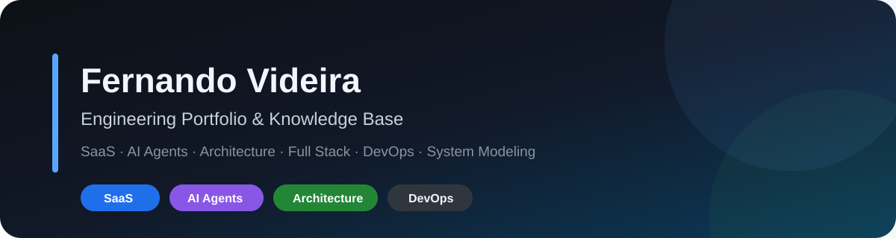
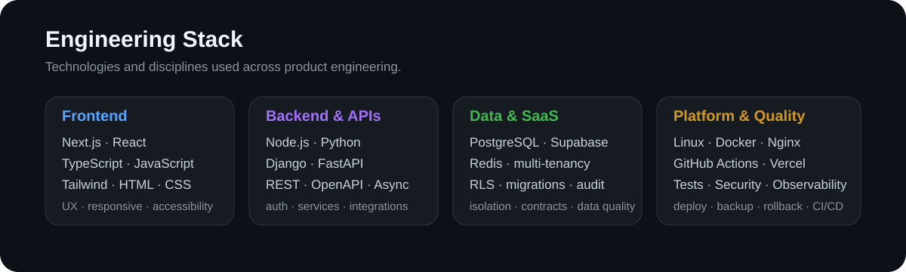
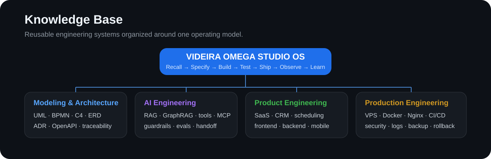
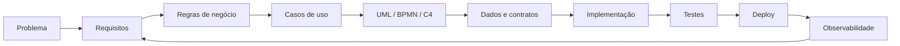

<p align="center"></p>

# Engineering Portfolio & Knowledge Base

Portfólio técnico aprofundado para organizar **projetos, arquitetura, skills reutilizáveis, decisões de engenharia e evolução open source**.

> O objetivo deste repositório é mostrar evidência técnica e método de trabalho, sem expor código privado, credenciais, clientes ou infraestrutura sensível.

## Engenharia

```text
REQUIREMENTS → ARCHITECTURE → BUILD → TEST → REVIEW → SHIP → OBSERVE → IMPROVE
```

Atuação e estudo concentrados em:

- SaaS multi-tenant;
- AI Agents, RAG, tools, guardrails e automação;
- CRM, agenda e atendimento omnichannel;
- APIs e integrações;
- Next.js / React / TypeScript;
- Node.js e Python;
- PostgreSQL / Supabase / Redis;
- Linux / Docker / Nginx / CI/CD;
- UML / BPMN / C4 / ADR / OpenAPI / AsyncAPI;
- testes, segurança, acessibilidade e observabilidade.

## Stack de engenharia

<p align="center"></p>

> **Python backend está em evolução contínua**, com Django/DRF e FastAPI aplicados a APIs, autenticação, services, testes, OpenAPI e execução ASGI.

## O que eu construo

| Área | Aplicação prática |
|---|---|
| **SaaS** | multi-tenancy, onboarding, permissões, catálogo, billing e isolamento por tenant |
| **AI Agents** | orquestração, RAG, tools, guardrails, memória, avaliação e handoff humano |
| **Messaging** | WhatsApp, Instagram, inbox, atendimento e automações |
| **CRM & Scheduling** | leads, agenda, serviços, profissionais, confirmações e notificações |
| **Backend** | APIs, autenticação, autorização, modelagem de dados e integrações |
| **Architecture** | UML, C4, BPMN, ADRs, contratos e rastreabilidade |
| **DevOps** | VPS, Linux, Nginx, Docker, CI/CD, deploy, backup e rollback |
| **Quality** | testes, segurança, acessibilidade, logs, métricas e observabilidade |

## Projetos públicos principais

### [SaaS Engineering Playbook](https://github.com/Videirafo/SaaS-Engineering-Playbook)
Manual público para arquitetura SaaS, multi-tenancy, segurança, APIs, testes, observabilidade e produção.

### [AI Agent Production Checklist](https://github.com/Videirafo/AI-Agent-Production-Checklist)
Checklist de produção para guardrails, tool policies, RAG/memória, evals, tracing, approvals e incident response.

### [System Modeling Starter](https://github.com/Videirafo/System-Modeling-Starter)
Starter para requirements, UML, BPMN, C4, ERD, ADR, OpenAPI, AsyncAPI e rastreabilidade.

## Clone & Build · projetos executáveis

Além da documentação, os três repositórios principais possuem exemplos que podem ser **clonados, abertos no VS Code, executados, testados e evoluídos com Git**.

| Projeto | Stack | O que demonstra | Validação |
|---|---|---|---|
| [SaaS Tenant Dashboard](https://github.com/Videirafo/SaaS-Engineering-Playbook/tree/main/examples/saas-tenant-dashboard) | Next.js · React · TypeScript | rota por tenant, UI, API health e organização de SaaS | typecheck + production build no GitHub Actions |
| [Safe Agent API](https://github.com/Videirafo/AI-Agent-Production-Checklist/tree/main/examples/safe-agent-api) | Python · FastAPI · pytest | tenant isolation, approval gate e bloqueio de tool destrutiva | pytest no GitHub Actions |
| [Booking Reference System](https://github.com/Videirafo/System-Modeling-Starter/tree/main/examples/booking-reference-system) | Python · FastAPI · pytest · Mermaid | requisito → regra → API → teste → rastreabilidade | instalação + pytest no GitHub Actions |

Fluxo esperado para quem quiser estudar ou contribuir:

```text
git clone
→ code .
→ Run / Debug ou task do VS Code
→ build / testes
→ git switch -c feat/minha-mudanca
→ git add .
→ git commit
→ git push
→ Pull Request
```

Cada exemplo contém README próprio, `.gitignore`, configuração `.vscode/`, comandos de execução e quality gate no CI. Nenhum deles depende de credenciais privadas para o fluxo básico.

## Cases de engenharia

Parte dos produtos permanece em repositórios privados. Aqui são documentados apenas escopo e decisões sanitizadas.

### MarcaIA

**SaaS multi-tenant para atendimento, agenda, CRM e automações com IA.**

`Next.js` · `TypeScript` · `PostgreSQL` · `Supabase` · `Tailwind` · `VPS` · `AI Agents`

Foco de engenharia:

- onboarding multi-tenant;
- agenda e marcação inteligente;
- serviços e profissionais;
- atendimento WhatsApp / Instagram;
- CRM operacional;
- autenticação e isolamento de dados;
- arquitetura preparada para agentes;
- deploy, observabilidade e GitHub Flow.

Veja também: **[Em desenvolvimento](./Em_desenvolvimento/README.md)**.

## Knowledge Base

<p align="center"></p>

### Sistema mestre

**[VIDEIRA OMEGA STUDIO OS](./skills/VIDEIRA_OMEGA_STUDIO_OS.md)**

```text
RECALL → CLASSIFY → DISCOVER → GROUND → SPECIFY → DESIGN → PLAN
→ ISSUE/BRANCH → BUILD → TEST → REVIEW → SHIP → OBSERVE → LEARN → REMEMBER
```

### Skills especializadas

| Skill | Conhecimento |
|---|---|
| [SYSTEM-MODELING-2026](./skills/SYSTEM_MODELING_2026.md) | requisitos, Caso de Uso, UML, BPMN, C4, ERD, ADR e contratos |
| [PY-BACKEND-2026](./skills/PYTHON_BACKEND_2026.md) | Django/DRF, FastAPI, APIs, segurança, testes e deploy |
| [GITHUB-PRO-2026](./skills/GITHUB_PORTFOLIO_OS_2026.md) | GitHub Flow, README, portfólio e qualidade de repositório |
| [AI Agent Engineering](./skills/AI_AGENT_ENGINEERING.md) | agentes, RAG, GraphRAG, tools, MCP/A2A, guardrails e avaliação |
| [Execution & Project Memory](./skills/EXECUTION_PROJECT_MEMORY.md) | Project Studio, COHI, PM26/PACREF, Focus Execution e Second Brain |
| [Frontend Product Experience](./skills/FRONTEND_PRODUCT_EXPERIENCE.md) | React/Next.js, mobile-first, acessibilidade, UI/UX e performance |
| [VPS & Production Engineering](./skills/VPS_PRODUCTION_ENGINEERING.md) | Linux, Docker, Nginx, deploy, backup, rollback e observabilidade |
| [Game Studio Mobile](./skills/GAME_STUDIO_MOBILE.md) | game design, arquitetura mobile, save, economia, monetização e publicação |

**[Abrir catálogo completo de skills →](./skills/README.md)**

## Engenharia de requisitos e arquitetura



Artefatos utilizados conforme necessidade:

- Casos de Uso e especificações textuais;
- UML Activity, Sequence, State e Class;
- C4 Context, Container e Component;
- BPMN;
- ERD e modelo relacional;
- OpenAPI / AsyncAPI;
- Architecture Decision Records;
- rastreabilidade requisito → código → teste.

## AI Engineering

```text
AI Engineering
├── LLM orchestration
├── RAG / GraphRAG
├── tool calling
├── MCP / agent interoperability
├── guardrails
├── conversation memory
├── human handoff
├── evaluation
└── observability
```

## Open Source & GitHub Growth

A estratégia é transformar GitHub em evidência pública de engenharia, sem atividade artificial.

```text
Projetos públicos úteis
→ Issues bem especificadas
→ PRs pequenos e verificáveis
→ CI verde
→ contribuições externas
→ colaboração real
→ releases
→ usuários / stars orgânicas
```

Documentos:

- [GitHub Growth Roadmap](./docs/GITHUB_GROWTH_2026.md)
- [Achievements & Badges 2026](./docs/ACHIEVEMENTS_AND_BADGES_2026.md)
- [Open Source Targets — agosto/2026](./docs/OPEN_SOURCE_TARGETS_2026-08.md)
- [Public Project Strategy](./docs/PUBLIC_PROJECT_STRATEGY.md)

## Princípios de execução

```text
Inspect before changing
Small reversible changes
Issue → Branch → Pull Request
Code and documentation evolve together
Security by design
Tests for critical behavior
Observability before production incidents
Backup and rollback before risky changes
Architecture decisions are recorded
```

## Segurança e privacidade

Este portfólio público não deve conter:

- senhas, tokens ou API keys;
- `.env` reais;
- chaves SSH/privadas;
- IPs ou endpoints internos sensíveis;
- dados de clientes;
- dumps de bancos;
- conversas privadas;
- código proprietário de repositórios privados.

Consulte [SECURITY.md](./SECURITY.md).

## Documentação

- [Base de conhecimento e skills](./skills/README.md)
- [Projetos em desenvolvimento](./Em_desenvolvimento/README.md)
- [Arquitetura e engenharia](./docs/ENGINEERING.md)
- [Sistema de documentação](./docs/DOCUMENTATION_STANDARD.md)
- [GitHub Growth Roadmap](./docs/GITHUB_GROWTH_2026.md)

---

<div align="center">

**Build · Test · Ship · Observe · Improve**

`Software Engineering` · `SaaS` · `AI Agents` · `Full Stack` · `DevOps`

</div>
